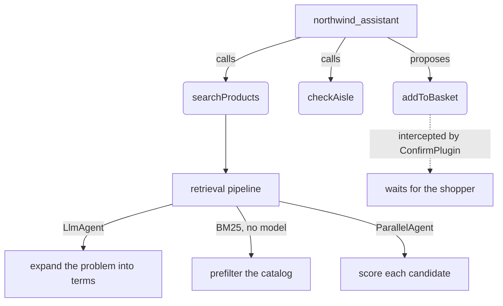

# Northwind Hardware: an on-device retail assistant (TypeScript)

This project implements a hardware-store storefront whose search and shopping
assistant both run on the language model Chrome ships with the device. A
shopper describes a problem in their own words — *"the thing that stops my door
slamming"* — and gets the part, without ever knowing it is called a soft-close
damper.

There is no server, no account and no API key. Nothing the shopper types leaves
the browser.

## Overview

Northwind exists to demonstrate three things about ADK for TypeScript in a
browser:

1. **ADK runs in a web page.** Not an extension, not Node. The agent, the
   runner, the plugin and the session service are the published `@google/adk`
   package, imported directly and bundled with no shims.
2. **ADK can drive an on-device model**, through a custom `BaseLlm` over
   Chrome's Prompt API.
3. **Some things are only possible on device.** Checking text for personal
   information before it is sent is the clearest case: to do that check in the
   cloud you must first send the personal information to the cloud.

## Agent Details

| Feature            | Description                                    |
| ------------------ | ---------------------------------------------- |
| _Interaction Type_ | Conversational, plus a retrieval pipeline      |
| _Complexity_       | Advanced                                       |
| _Agent Type_       | Multi-agent, fan-out, with a plugin            |
| _Components_       | Custom `BaseLlm`, Tools, `ParallelAgent`, `BasePlugin` |
| _Runtime_          | Browser, as an ordinary web page               |
| _Model_            | Chrome's built-in on-device model              |
| _Vertical_         | Retail                                         |

### Agent Architecture



The search path is a three-stage funnel: expand the shopper's words into search
terms, prefilter 148 products deterministically with BM25, then score the
survivors one at a time with a `ParallelAgent`. Asking a small model to rank a
whole catalog in one prompt is the thing it does worst; asking it to score one
product is the thing it does well.

### Key Features

- **Search by problem, not by part name.** The catalog is indexed on symptoms
  as well as nouns.
- **Nothing changes the basket without a person.** `ConfirmPlugin` intercepts
  every write tool, records it as a proposal and returns that to the agent, so
  the model can say what it has prepared and cannot act on it.
- **Personal information is caught before it is sent.** Rules find the obvious
  shapes; one model call catches the rest. Both run in the page.
- **An audit trace.** Model calls and network requests are counted on screen.
  Network requests stay at zero.
- **An honest fallback.** With no usable model the app runs a scripted stand-in
  and says so in a badge and a banner.

#### Tools

Defined in [`src/core/assistant.ts`](src/core/assistant.ts):

- `searchProducts`: runs the retrieval pipeline over the catalog.
- `checkAisle`: reports the aisle and stock for a product.
- `addToBasket`: **a write tool.** Never executed by the model. `ConfirmPlugin`
  turns the call into a proposal the shopper approves or rejects.

## Setup and Installation

### Prerequisites

- **Chrome 148 or newer.** The Prompt API reached ordinary web pages later than
  it reached extensions, and this sample is a web page.
- **Desktop only.** macOS 13+, Windows 10/11, Linux, or ChromeOS on Chromebook
  Plus.
- **22 GB free disk**, and either more than 4 GB of VRAM or 16 GB of RAM with
  4 or more cores.
- **Node.js 20 or higher** to build.

Check the machine in ten seconds:

```bash
npm run doctor
```

### Installation

```bash
npm install
```

> **One extra step, for now.** This sample imports `@google/adk` directly and
> bundles it for the browser, which works once
> [#614](https://github.com/google/adk-js/pull/614) and
> [#618](https://github.com/google/adk-js/pull/618) are in a published release.
> Until then, run:
>
> ```bash
> npm run patch:adk
> ```
>
> That patches the installed copy in `node_modules` to look the way the
> released package will: one bundled browser entry, and the `browser` export
> condition. It changes nothing in this repository, and `npm ci` undoes it.
> When the release lands, `scripts/patch-adk.mjs`,
> `scripts/adk-browser-shims/` and this note all delete.

## Running the Agent

```bash
npm run serve
```

Open <http://localhost:8877/>.

The first search downloads the model. Chrome fetches it once for the whole
browser, and it is a couple of gigabytes. The download only starts after you
interact with the page.

### Things to try

Search, from the hero field:

- `the thing that stops my door slamming`
- `my tap drips even when it is off`
- `something to stop the shed door blowing open`
- `covers up a hole in plasterboard`

The assistant, from the panel on the right:

- `add the door thing to my basket`

  It proposes the change and waits. Nothing enters the basket until you accept.

Reviews, on the **Cordless Combi Drill 18V** product page:

- Reach it through the **Power Tools** category bar rather than search, so you
  can see that browsing runs zero model calls.

## Commands

```bash
npm run serve       # build and serve on :8877
npm run build       # build into dist/
npm run dev         # rebuild on change
npm test            # 33 tests
npm run typecheck
npm run check       # typecheck, build, test
npm run doctor      # can this machine run the model?
```

## What is honest to claim

- **The model runs on the device.** Nothing the shopper types is sent anywhere.
  The audit trace counts network requests, and the count stays at zero.
- **The stand-in is not a model.** When Chrome has no usable model the app
  falls back to a scripted heuristic, and the badge, the banner and the audit
  trace all say `SIMULATED`. Never present that output as inference.
- **No cost claim.** There is no token meter here, so there is no baseline and
  no number to quote.

## License

Apache 2.0. See [LICENSE](LICENSE).

Demonstration code, not a supported product.
